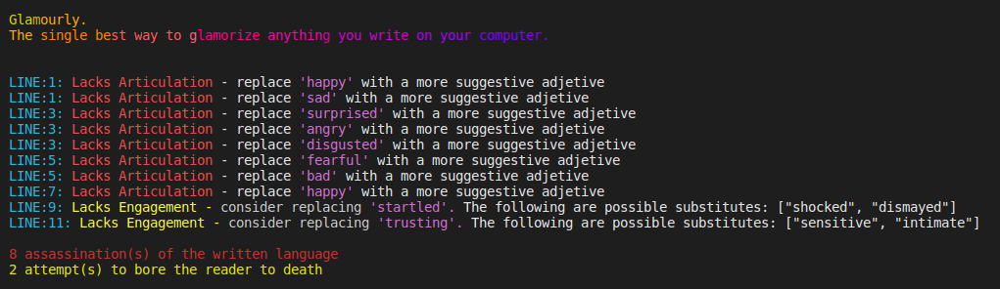
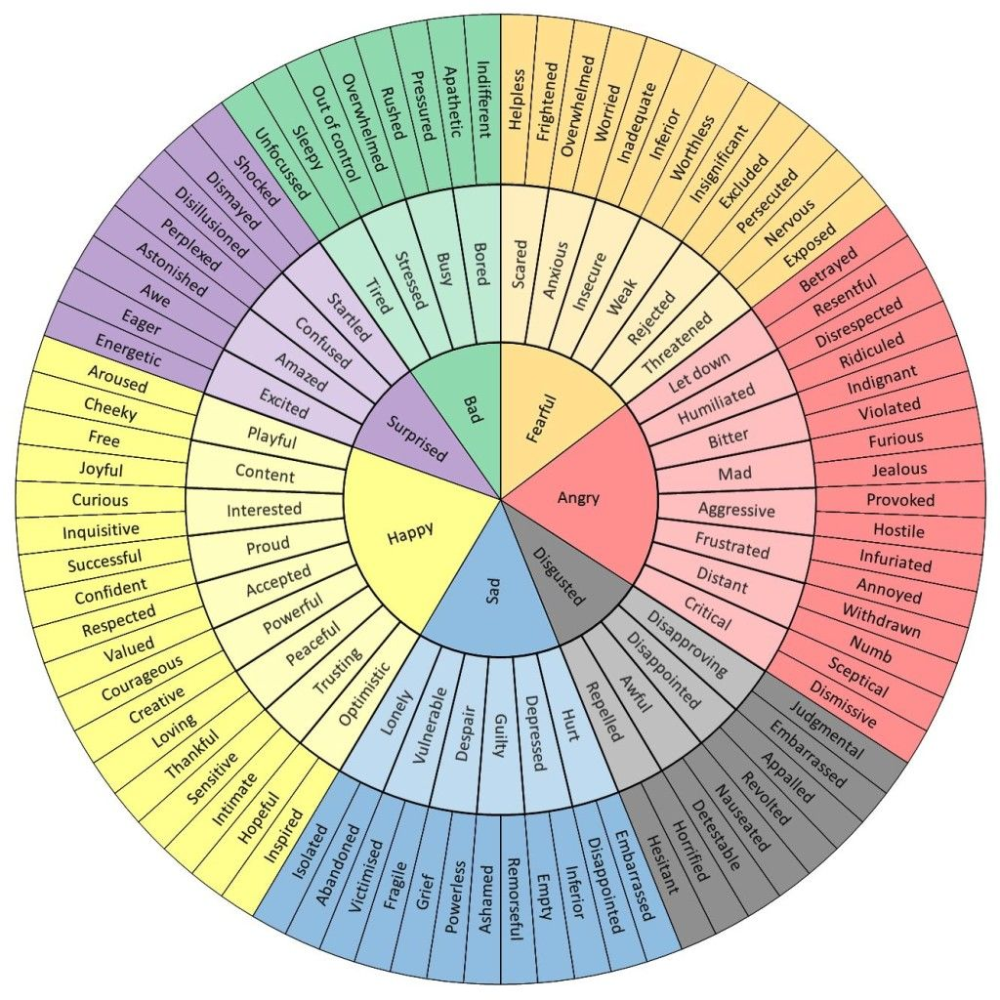
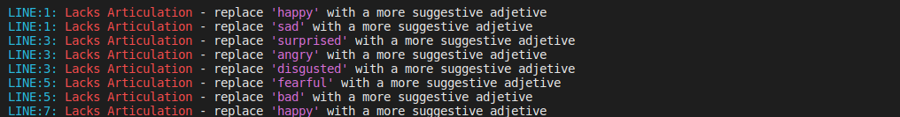
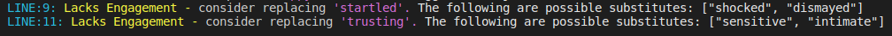
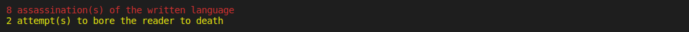
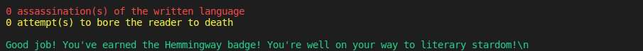

# Glamourly - If you want to glamorize anything you write on your computer, you need to get Glamourly

 

  

  <h3 align="center">Linter</h3>

  

    This project is a part of the Microverse Ruby curriculum
     
    <a href="https://github.com/guirecordon/linter"><strong>Explore the docs »</strong></a>
     
     
    <a href="https://github.com/guirecordon/linter/issues">Report Bug</a>
    ·
    <a href="https://github.com/guirecordon/linter/issues">Request Feature</a>
  

  

## Table of Contents

* [Usage](#usage)
* [Development](#development)
  * [Built With](#built-with)
* [Author](#author)
* [Show Support](#show-your-support)
* [Acknowledgements](#acknowledgements)

## Usage

If you already have Ruby installed in your computer, go to [install gems](#install-gems).

If you're not sure wether or not you have Ruby, type the following in your command line: 
`ruby -v`
That should return the version of Ruby that's running on your computer. 

If you need to install Ruby, follow the instructions in this [webpage](https://www.ruby-lang.org/en/documentation/installation/).

### instal gems

You're going to need the following gems, if you don't have them already.

#### 'colorize'

`gem install colorize`

#### 'lolize'

`gem install lolize`

### Clone the Repo

Now, all you have to do is clone this repo to your local machine.

1. Run the following on your terminal to clone this repo to your computer  
    `git clone git@github.com:guirecordon/linter.git`

2. When you open the repo, you will see a txt file called user.txt.
   Remove the example text and paste your own text (email, essay, etc) into the body of the user.txt file 

3. From the command line, from the root directory (the main linter repo folder), run the following:
   `ruby bin/main.rb`

## Development

Glamourly is designed to help users improve their writing skills by expanding their vocabulary.

I got the idea after I came across this vocabulary diagram I found online: 

I designated the words inside of the innermost circle level 1. They should be avoided at all costs. The user gets a red linter "error" if they try to use one of those.

I designated the words in the middle circle level 2. Because they are already more descriptive adjectives, instead of a red linter error, the user is simply asked to consider replacing them with even more sophisticated options. The user is then prompted with a couple of suggestions taken from words inside of the outer layer of the diagram above.

The two last lines display the sum of occurrences of level 1 and level 2 errors. 

At this point, the user is faced with humorous linter messages that suggest the assassination of the language and attempts to bore the readers. It is supposed to be burlesque, no offense is intended. (I hope you noticed I used the word "burlesque"—thanks Glamourly for improving my writing ;D)

Another reason why the linter errors sound purposedly dramatic is to pick up on the seemingly overdramatic nature of linter error names that pop up in one's command line (things like 'fatal', 'offenses', etc) 

Lastly, if the user manages to avoid all of level 1 and 2 words, he or she is granted the "Hemmingway" badge and is greeted for a job well done.

### Built With
* Ruby
* Rspec

## Author
👤 **Guilherme Recordon** 

- Twitter: [@guirecordon](https://twitter.com/guirecordon) 
- Github: [@guirecordon](https://github.com/guirecordon)
- LinkedIn: [@GuilhermeRecordon](www.linkedin.com/in/gui-recordon-marketingmba/)

## Show your support

Give a ⭐️ if you like this project!

## Acknowledgements

A shout out to all of my Microverse team for the support. Special thanks to @bren2102 for helping me figure out how to start this project!

## License

The gem is available as open source under the terms of the [MIT License](https://opensource.org/licenses/MIT).
